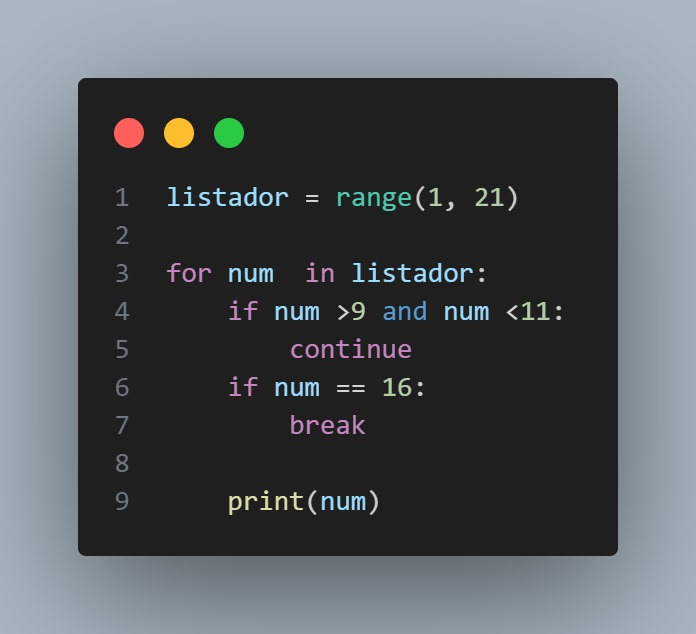

# Ejercicio_6


<figure style="text-align: center;">
  
  <figcaption><strong></strong></figcaption>
</figure>

## **Índice**
1. [**Descripción**](#descripción)
2. [**Instalación**](#instalación)
3. [**Uso**](#uso)
4. [**Estructura del Código**](#estructura-del-código)
5. [**Requisitos**](#requisitos)
6. [**Licencia**](#licencia)
7. [**Autor**](#autor)

## **Descripción**

Este código en Python imprime los números del 1 al 20 utilizando un bucle `for`. Sin embargo, tiene dos condiciones especiales:

1. **Omitir el número 10**: Se usa la sentencia `continue` para evitar la impresión del número 10.
2. **Detener el bucle en el número 16**: La sentencia `break` detiene la ejecución del bucle cuando se alcanza el número 16, impidiendo que el bucle continúe hasta el número 20.

## **Instalación**

1. Asegúrate de tener **Python 3.12** o superior instalado en tu sistema.
2. Instala **Git** si aún no lo tienes.
3. Clona el repositorio desde GitHub con el siguiente comando:
   ```bash
   git clone https://github.com/Mogollo7/MenuCalculadora.git
## **Uso**

Para ejecutar el código, abre una terminal o línea de comandos, navega hasta el directorio donde guardaste el archivo `.py` y ejecuta el siguiente comando:

```bash
python Ejercicio_6.py
```
El código imprimirá los números del 1 al 20, omitiendo el número 10 y deteniéndose en el número 15.

## **Estructura del Código**
[Explicación](https://www.youtube.com/watch?v=YqUGzgVIOrQ))
El código se estructura de la siguiente manera:

1. **Range**: Se define un rango utilizando `range(1, 21)`, lo que genera una secuencia de números del 1 al 20.
2. **Bucle for**: Itera sobre cada número en el rango, ejecutando el bloque de código dentro de él.
3. **Condicional if**: Se usan dos sentencias `if`:
   - La primera evalúa si el número está entre 10 y 11. Si es así, se ejecuta `continue`, que salta esa iteración.
   - La segunda evalúa si el número es igual a 16. Si es así, se ejecuta `break`, que termina el bucle.
4. **Impresión**: Si ninguna de las dos condiciones se cumple, el número actual se imprime en pantalla.
### Código:

```python
listador = range(1, 21)

for num in listador:
    if num > 9 and num < 11:
        continue
    if num == 16:
        break
    
    print(num)
```
Este código imprimirá los números del 1 al 20, omitiendo el número 10 y deteniéndose al llegar al número 16.

## Requisitos

- Python 3.12+

## Licencia

Este proyecto está licenciado bajo la **MIT License.**

## Autor

[Juan Sebastián Martínez Galeano](https://github.com/Mogollo7?tab=repositories)
